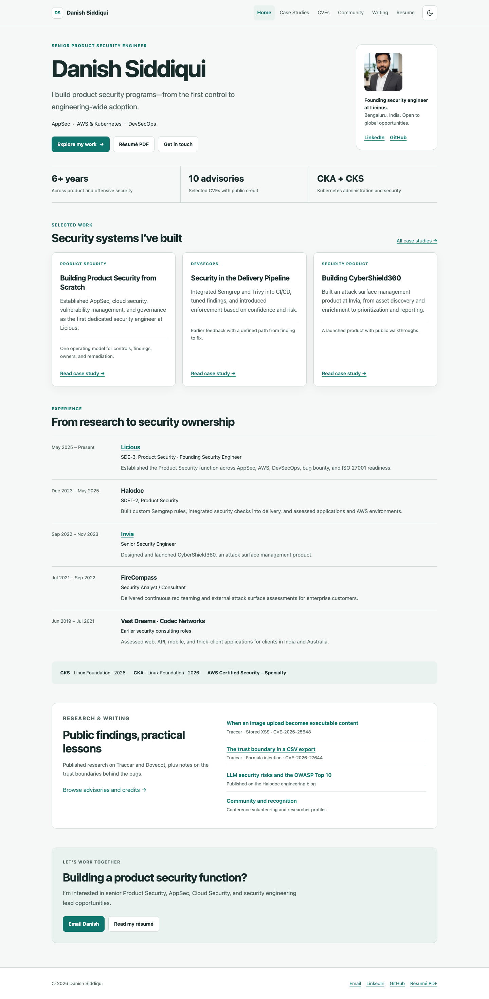
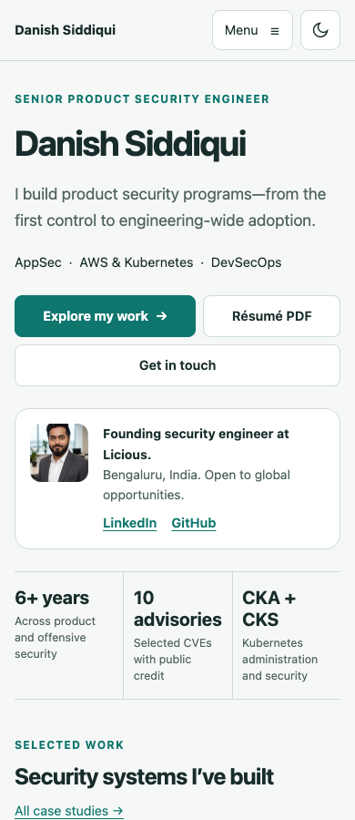
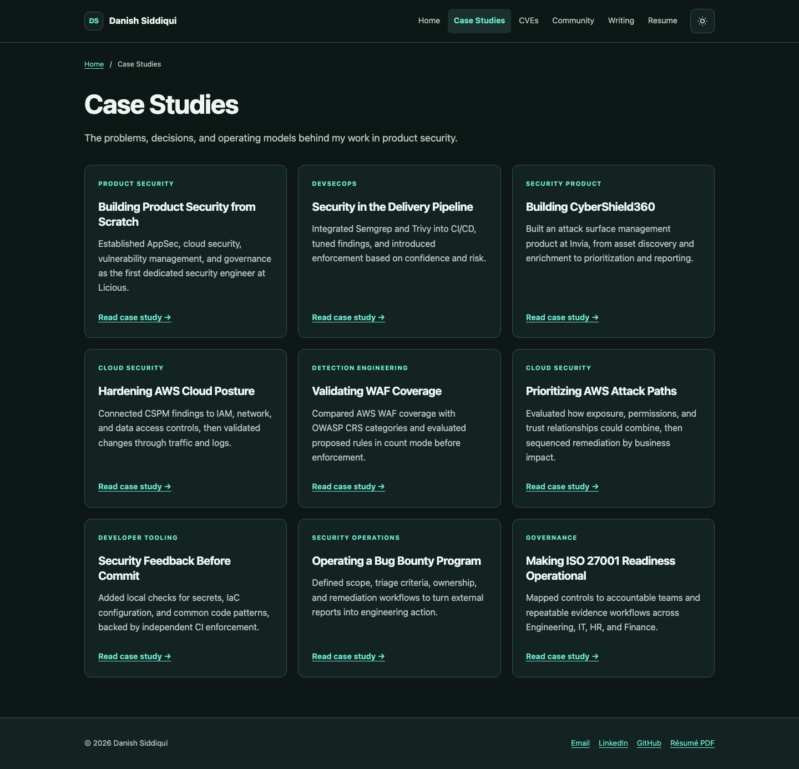

# Portfolio update review

Reviewed locally on 10 September 2026. This document and its screenshots are excluded from the website build.

## What changed

The homepage now leads with the security work, three featured case studies, and a résumé-backed career timeline. Case-study cards show complete titles. A compact mobile menu, consistent reading widths, accessible light and dark colors, and keyboard controls replace the conflicting theme styles.

The CVE showcase contains 10 selected public advisories with checked publisher acknowledgments and corrected classifications. Lead case studies include simplified workflow diagrams and clearer evidence links. Three new technical notes link to their public sources. Page metadata, social previews, the portrait asset, and build validation are also updated.

See [content provenance and outstanding details](content-notes.md) for the seven omitted CVE entries, missing metric context, and credential verification links that still need owner input.

## Validation

- Jekyll production build completed with Ruby 3.2.11 and locked dependencies.
- Generated-site checks passed for all 20 pages: headings, metadata, social images, local links, anchors, assets, and CVE data.
- Chromium browser review passed 88 combinations: all 20 pages at 390px and 1440px in light and dark themes, plus four key pages at 320px and 768px.
- No horizontal overflow, broken images, failed local asset requests, or JavaScript errors were detected in those browser checks.
- axe-core 4.10.3 found no violations in the tested WCAG A/AA and best-practice rules. This is automated coverage, not a complete accessibility certification.
- Mobile menu keyboard handling, theme persistence, JavaScript-disabled navigation, and unavailable local storage were checked separately.
- At a 390px viewport, the homepage decreased from 6,409px to 4,465px in height, about 30% shorter. This measures page length, not load speed.

Pull requests run the build and static checks. Only the existing deployment workflow on `main` can publish the update.

## Screenshots

### Desktop homepage

### Mobile introduction

### Case studies in dark mode

