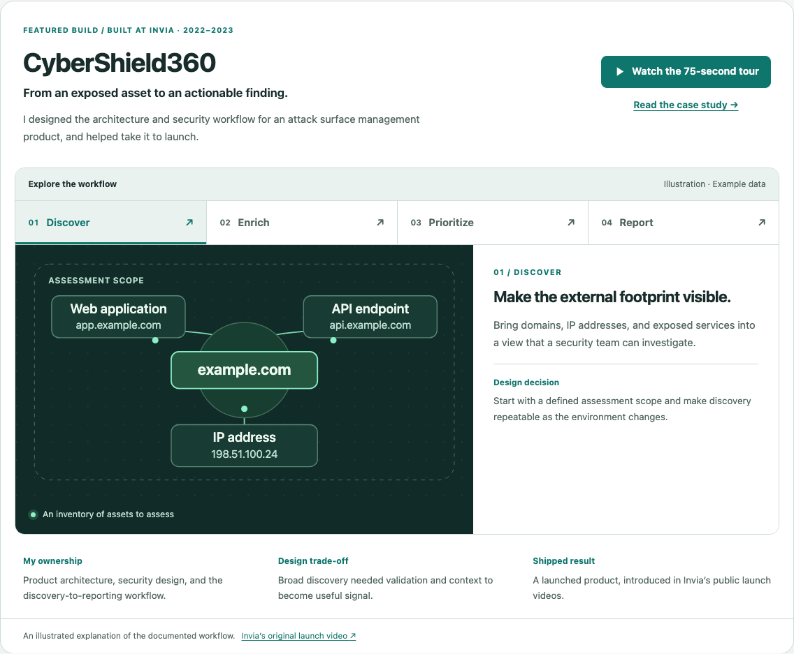
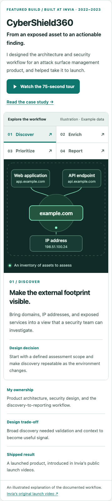
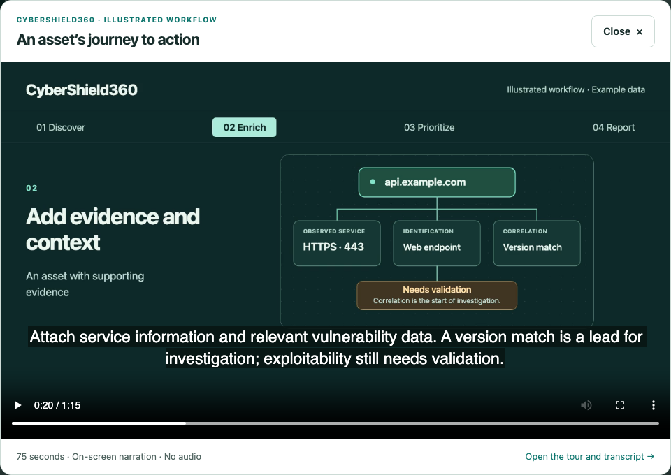

# CyberShield360 showcase

This update gives CyberShield360 a visual, interactive feature on the homepage and its case-study page. Visitors can explore discovery, enrichment, prioritization, and reporting, then watch a 75-second illustrated tour or read its transcript.

## Content and provenance

- The ownership summary follows the existing case study: product architecture, security design, the discovery and analysis pipeline, and collaboration through launch at Invia in 2022–2023.
- The two existing public YouTube links were inspected. Both are Invia promotional launch videos, not recordings of the working interface. Labels and case-study wording were corrected to reflect this.
- The diagrams and tour are newly authored illustrations of the documented workflow. The visible labels state that they use example data. No interface screenshots, customer assets, scan results, production metrics, or private implementation details are fabricated.
- The example domains use `example.com`, and the example IP is from the documentation range `198.51.100.0/24`.
- Actual interface screenshots were not available in the repository or reviewed public media. The owner was asked for a local source folder; genuine screenshots can be incorporated when available.
- The tour’s English narration is available as a caption track and an HTML transcript. The video has no audio and starts only after a visitor chooses to play it.

Public references:

- [Invia launch overview, 25 October 2023](https://www.youtube.com/watch?v=4FVeZtl4WZs)
- [Invia extended introduction, 11 October 2023](https://www.youtube.com/watch?v=a-o99XjxkMw)
- [Invia product page](https://www.invia.com.au/CyberShield360)

## Implementation

The feature uses shared Jekyll includes, data, local CSS, and local JavaScript. It adds no frontend framework, external fonts, or third-party requests. Video, captions, and the hidden player’s poster are assigned after activation. The standalone tour page remains usable without JavaScript.

Tabs support arrow keys, Home/End, focus indication, and links to individual stages. The native dialog handles focus containment, Escape, a close button, and pausing on dismissal. Reduced-motion preferences disable panel transitions. Phone diagrams use larger labels in compact layouts.

The video is generated from the same stage data and SVG diagrams with `scripts/render_cybershield_tour.py`. Generated media are committed, so deployment does not require a video render.

## Validation

Local validation on 11 September 2026 passed: 21 generated pages, 24 Chromium page/viewport/theme scenarios, 44 automated accessibility checks, four interaction checks, and three fallback checks. All 20 existing page URLs and the résumé PDF were preserved. The video is 75 seconds at 1280 × 720 and under 300 KB.

The deployment workflow runs the existing static checks plus `scripts/check_showcase.py` in Chromium and WebKit. The browser suite covers three affected pages at 320, 390, 768, and 1440 pixels in both themes. It also checks stage selection, keyboard navigation, direct links, lazy media loading, playback, caption timing, modal dismissal, JavaScript-disabled fallback, and reduced motion with unavailable local storage.

axe-core 4.10.3 checks the tested WCAG A/AA and best-practice rules. These automated checks do not constitute a complete accessibility certification.

## Screenshots

